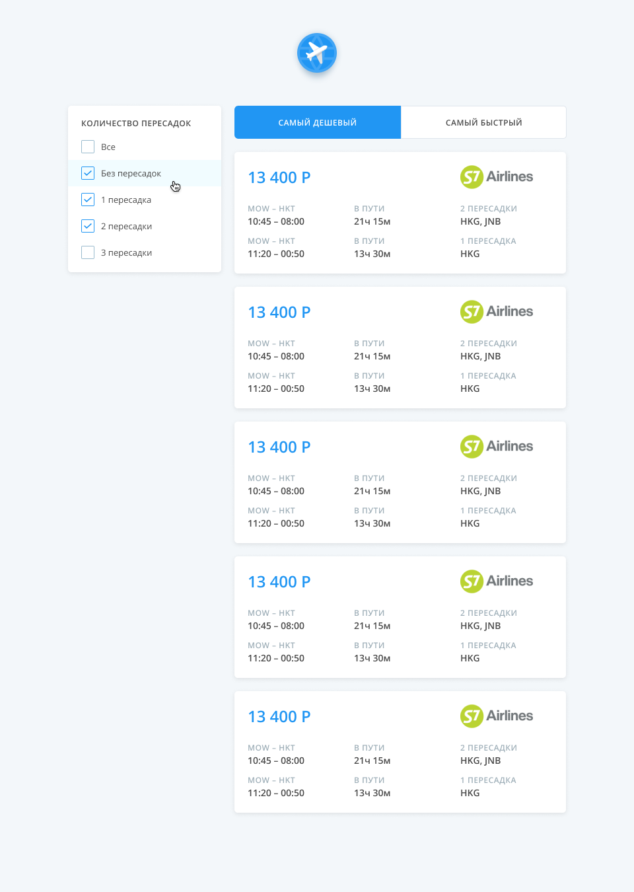

## Задание
Основной frontend проект нашей команды — это страница выдачи билетов со множеством фильтров, настроек и, собственно, билетов. Проект написан на React, поэтому тестовое задание приближено к ежедневным задачам.

Перед тобой упрощенный макет нашего проекта — список билетов, фильтры и сортировка. Также у нас есть небольшой сервер для тестового задания, который работает схоже с нашим основным backend движком и реализует технику long polling для передачи пачек билетов. Тебе необходимо реализовать клиент, который будет получать случайно сгенерированные билеты от сервера и отрисует интерфейс согласно макету в Figma. Достаточно будет отрендерить 5 первых билетов соотвествующих выбранным фильрам и сортировки.

## Условия
* Используй React
* Используй TS или JS
* Работоспособность в актуальной версии Google Chrome
* Остальное на твоё усмотрение

## Документация по работе с сервером: [Здесь](https://github.com/KosyanMedia/test-tasks/blob/master/aviasales_frontend/server.md)

## Макет

https://www.figma.com/file/4fQe1lEbo4DARjvNtaU0uJ/Aviasales-test-task

## Работа с приложением

Для сборки и локальной работы использовала Create-React-App.

Стэк разработки:
* React
* Redux
* Redux-Saga
* Styled-Components
* Reselect
* moment

Рабочее приложение доступно по ссылке:
[https://yulya9060.github.io/simple-search](https://yulya9060.github.io/simple-search)

## Скрипты

### `yarn start`

Для запуска приложения для разработки [http://localhost:3000](http://localhost:3000)

### `yarn build`

Для сборки приложения

